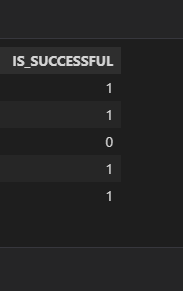
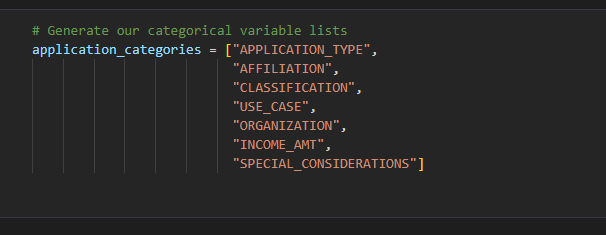
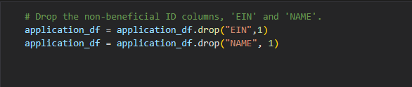
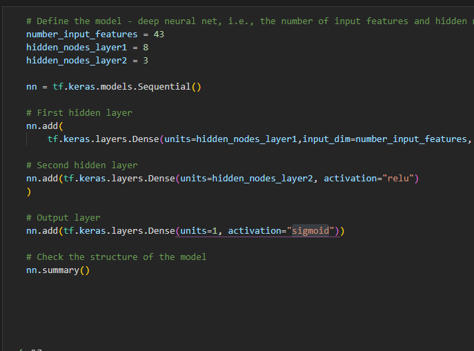

# Neural_Network_Charity_Analysis_Tensorflow

## Overview of the analysis: 
From Alphabet Soup’s business team, Beks received a CSV containing more than 34,000 organizations that have received funding from Alphabet Soup over the years.
With knowledge of machine learning and neural networks, I used the features in the provided dataset to help Beks create a binary classifier that is capable of predicting whether applicants will be successful if funded by Alphabet Soup.

### Results: 

#### Data Preprocessing:

  - The Is_SUCCESSFUL is a target for the model.

  
  
  
  - The variables for my model is APPLICATION_TYPE,AFFILIATION,CLASSIFICATION,USE_CASE,ORGANIZATION,INCOME_AMT,SPECIAL_CONSIDERATIONS

  
  
  
  - The variables that are not targets nor features are EIN and NAME.

  
  
  

#### Compiling, Training, and Evaluating the Model

  -I have 43 neurons, 2 layers, and the sigmoid activation because it had the best result from what I tried.
  
  
  
  -I was not able to reach it with the first run with .44 accuracy and then the second run with .66.
  
  
  -To increase preformance I added and epoch checkpoints, I lowered the epoch to 50 and added a third hidden layer.
  
  
#### Summary:

The results that I have obtained showed me that by changing the hidden layers and lowering the epochs we can achive a higher accuracy score. 
What I would suggest is to further look into the changes that occur when changing the activation function from sigmoid to something else with different layers as well.

